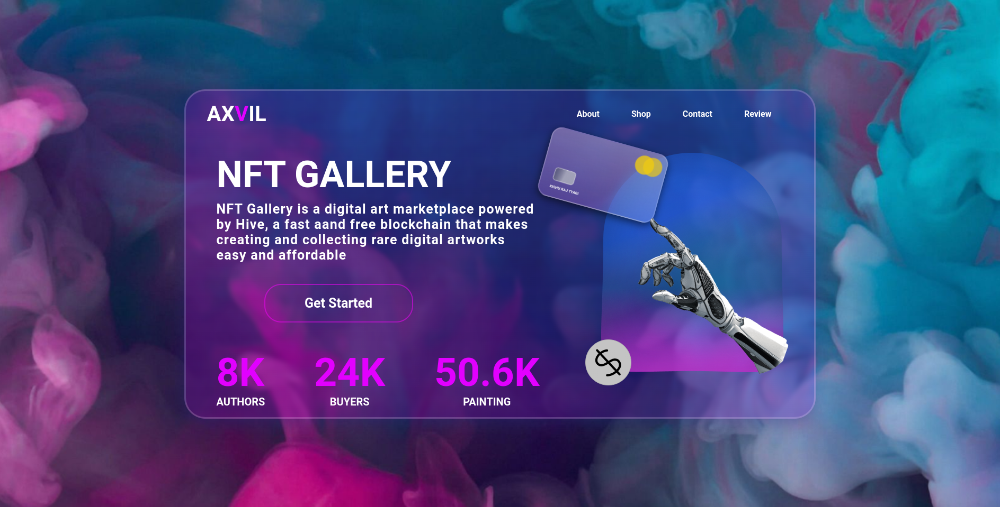

<h1 align="center">
  NFT Gallery
</h1>

  

 

# Tecnologias

Este projeto foi desenvolvido utilizando:

- <a href="https://pt-br.reactjs.org/">ReactJS</a>
- <a href="https://hype4.academy/tools/glassmorphism-generator">Glassmorphism</a>
- <a href="https://sass-lang.com/">SASS</a>

 

# Status do projeto

Finalizado (apenas versão desktop): link

 

# Inspiração

Figma Community: https://www.figma.com/file/dXYwdeBHEd4FN7pMBGIxlT/NFT-GALLERY-(Community)?node-id=0%3A1

Designer: <a href="https://www.figma.com/@Kishu09">Kishu Raj Tyagi

 

# Desenvolvedor

[Durval Henrique 
(Lavrudinho)](https://github.com/Lavrudin)

 

# Licença

<a href="https://github.com/Lavrudin/nike-lebron-19-space-jam-concept-site/blob/main/LICENSE.md" target="_blank">LICENSE</a>
